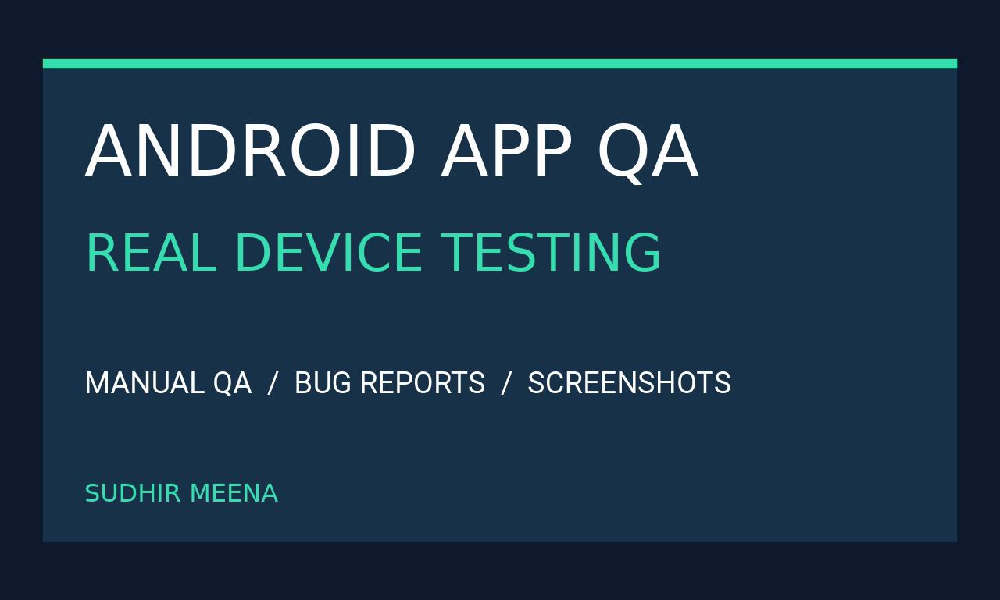

# Fossify Calculator 1.4.0 | Android QA Practice Case Study

**Independent, self-initiated practice project by Sudhir Meena.** This is not paid client work and is not affiliated with or endorsed by the app developer.

## Project at a glance

- **App:** Fossify Calculator 1.4.0 (third-party Android app)
- **Devices:** Two physical Android phones: Samsung Galaxy M51 and Redmi Note 9 Pro Max (RN9)
- **Setup:** Manual testing with an ADB-supported Windows CI Lab where available
- **Evidence:** A 50-row case matrix with mixed execution/verification statuses, a QA report and selected cropped screenshots

**Important:** 50 case-matrix records does **not** mean 50 executed or passed tests. Read each row's `status`, `verification_method` and `limitations_or_provenance` before interpreting results. Some checks were static-only, observed-only, not run or pending user verification. Do not treat short diagnostic samples as proof of crash-free operation or full accessibility compliance.

## Browse the evidence

| Item | What it contains |
| --- | --- |
| [CASE_MATRIX.csv](CASE_MATRIX.csv) | Individual case, device, expected/actual result, status, method and limitations |
| [QA_REPORT.md](QA_REPORT.md) | Test scope, findings, evidence and explicit limitations |
| [Cover](00_QA_Cover.png) | Project overview graphic |
| [M51 decimal sample](M51_decimal_sum_cropped.png) / [M51 negative sample](M51_negative_cropped.png) | Cropped sample UI results |
| [RN9 decimal sample](RN9_decimal_sum_cropped.png) / [RN9 negative sample](RN9_negative_cropped.png) | Cropped sample UI results |

## Scope and privacy

These are selected results from a personal practice exercise, **not** an app certification, developer endorsement, whole-app performance benchmark or guarantee of compatibility. Only selected sanitized/cropped screenshots are public; private logs, serial numbers, account data, full-screen captures and private UI dumps are excluded. Findings apply to the documented devices and test scope.

## Contact

[Upwork profile](https://www.upwork.com/freelancers/~012da20388e902c874) · [Fiverr profile](https://www.fiverr.com/sudhir_models)

For a new engagement, share the APK, target Android versions, testing scope and timeline through the relevant freelance platform.
